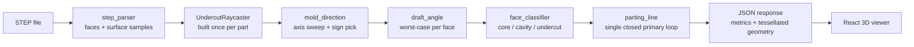
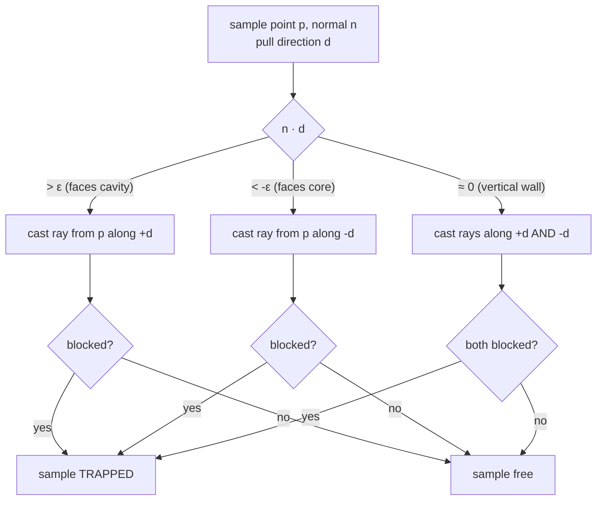
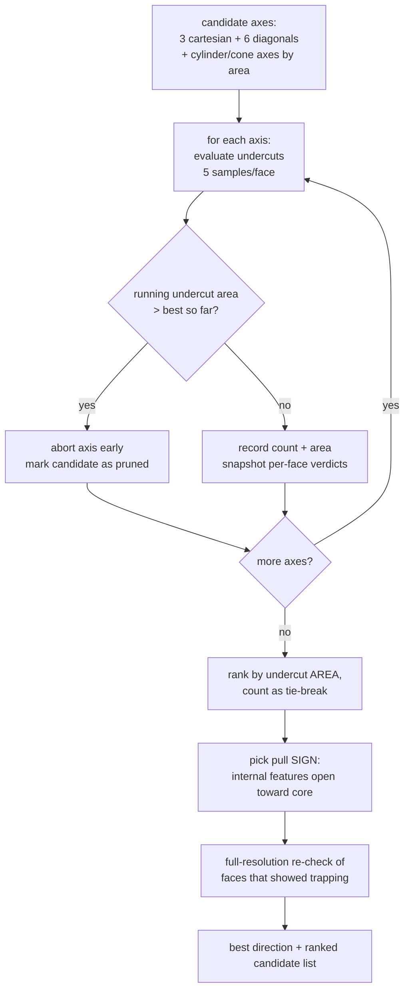
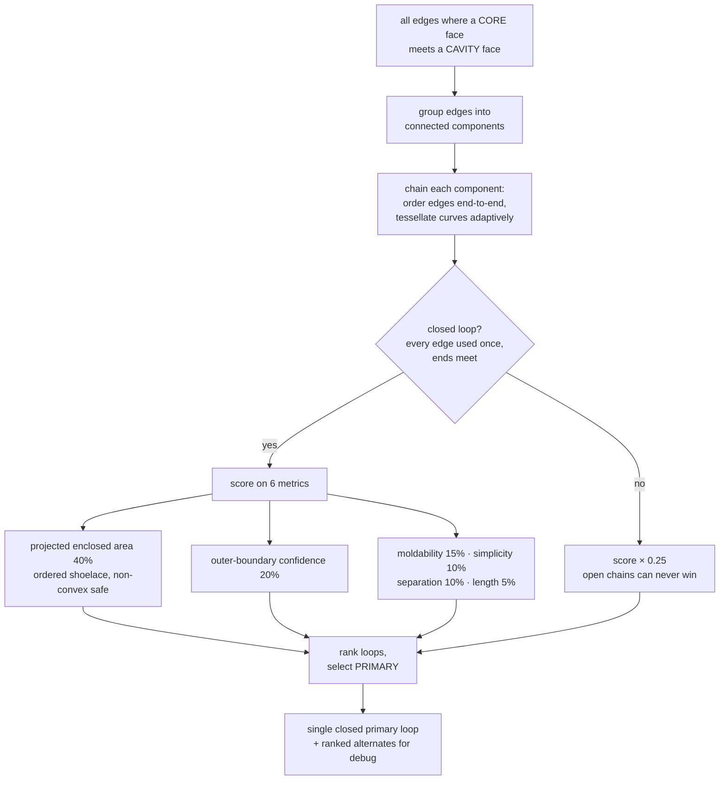

# Technical Document — Methodology Report

DfM Analyzer for Injection Molding — Team Stack.
Covers: system architecture, algorithms (with flowcharts), validation results,
and performance. Reflects the v2 engine (Phase 2, July 2026).

---

## 1. System Architecture

Client–server, deliberately simple:

- **Backend — Python / FastAPI** (`api.py`): one endpoint `POST /analyze`
  (multipart STEP upload, optional `direction=x,y,z` form field for manual
  override). All geometry runs on OpenCASCADE via the `OCP` bindings
  (`cadquery` for tessellation export).
- **Frontend — React + Vite** (`frontend/`): three.js via
  `@react-three/fiber`. Renders color-coded faces (core / cavity / undercut /
  low-draft warning), the parting line, an exploded core–cavity view, and the
  mold-direction override panel.
- **CLI harness** (`scripts/analyze_cli.py`): headless regression runner used
  to validate every algorithm change against reference parts.

---

## 2. STEP Parsing & Surface Sampling (`core/step_parser.py`)

Every face gets a **grid of surface samples**, not just its UV midpoint:

1. Explore all `TopAbs_FACE` entities; compute area, centroid, surface type.
2. Sample a UV grid (3×3 for planes, 5×5 for curved surfaces, capped at 15
   points). Each UV point is kept only if it classifies `TopAbs_IN` (actually
   on the trimmed face, not in a hole).
3. Store the exact surface normal at every sample
   (`GeomLProp_SLProps`, flipped for reversed faces).
4. For cylinders/cones, store the rotational axis — these become
   geometry-driven mold-direction candidates.

**Why**: a cylinder's midpoint normal misrepresents the surface (its normals
span up to 360°). Phase 1's single-normal approach was the root cause of the
undercut false positives. Multi-sampling makes every downstream verdict an
area-weighted vote over the real surface.

---

## 3. Undercut Detection (`core/undercut_detector.py`)

**Definition used (from Bosch):** *an undercut is any feature that cannot be
released from the mold* for the chosen opening direction.

A face is trapped only if **neither mold half can pull away from it**:

- Rays via `IntCurvesFace_ShapeIntersector` over a compound of all faces,
  built **once** per part and reused for every direction tested.
- Ray origin offset 0.01 mm along the surface normal; hits closer than
  0.1 mm ignored (self-intersection noise); ray length = 1.5× the part's
  bounding-box diagonal.
- **Transition filter**: only hits where the ray *enters* material
  (`IntCurveSurface_In`) count as blockers. Tangential grazes along adjacent
  walls/fillets (`Out`/`Tangent`) are not physical obstructions — this
  filter is what brings Part 1 to the judges' reference answer of **zero
  undercuts**.
- **Face verdict**: a face is an undercut when ≥ 50 % of its samples are
  trapped (`trapped_fraction`), with per-face early exit once the majority
  is decided either way.
- The trapped test is symmetric in ±d — undercuts depend on the mold *axis*,
  which halves the direction search.

---

## 4. Optimal Mold Direction (`core/mold_direction.py`)

Key decisions:
- **Ranking metric — area first** (per Bosch guidance): a face split into
  several patches must not outrank one large trapped face.
- **Branch-and-bound pruning**: faces are evaluated biggest-first; an axis is
  abandoned the moment its accumulated undercut area exceeds the incumbent
  best. Losing axes cost ~0 s. Pruned candidates are reported as lower
  bounds (`≥ N` in the UI, `undercuts>N` in the CLI) — never as exact values.
- **Sign selection**: undercut counts are sign-symmetric, but which half is
  *core* vs *cavity* is not. Convention (validated on the judges' cap
  example): **the core forms the internal surfaces**, entering from the side
  the part's internal features open toward; the pull direction (toward the
  cavity) is the opposite. Internal features are detected by ray probes: a
  sample whose own normal points at more part material across a void belongs
  to an internal feature, and the axis direction it escapes toward marks the
  core side. Faces covering 90 % of the surface area vote (area-weighted).
- **Winner refinement**: verdicts of the incumbent best axis are snapshotted
  during the sweep; at the end, only faces that showed any trapping are
  re-evaluated at full sample resolution.

## 5. Manual Override

`POST /analyze` with `direction=x,y,z` skips the search and evaluates exactly
that vector: undercuts, classification, parting line, and score are recomputed
so the user immediately sees the consequence of their choice (e.g. previously
free faces flagged as undercuts). The UI exposes ranked candidate buttons, a
custom vector input, and a reset to the auto-detected optimum.

---

## 6. Face Classification (`core/face_classifier.py`)

Every face gets `mold_half` (which half **forms** it) and `classification`
(render label: core / cavity / undercut):

1. **Normal voting**: area-weighted vote over surface samples —
   `n·d > 0` → cavity, `n·d < 0` → core.
2. **Vertical walls** (all samples perpendicular): assigned by
   **reachability** — rays from the wall toward each half; if the path
   toward the cavity is blocked (e.g. a bore under a closed top), only the
   core can form it, and vice versa.
3. **Through-holes / internal channels** (reachable from both halves but
   facing part material across a void): assigned to the **core** (core-pin
   convention, matching the judges' cap example).
4. **External walls reachable from BOTH halves** are genuinely ambiguous —
   physics does not decide them, and either assignment yields a
   manufacturable mold. They are deferred, grouped into connected
   **regions**, and each region is assigned by the **shared edge length** it
   has with already-decided faces (`_resolve_ambiguous_regions`). Taking the
   side with the greater shared length yields the shorter core↔cavity
   interface — the mold-design principle of keeping the split on the
   shortest closed boundary. Edge length is the weight because it is exactly
   the parting line produced; face area never appears in the boundary.
   Undercut faces are excluded from voting (a side action releases them, so
   they must not steer the main parting line). A region with no decided
   neighbour, or an exact tie, falls back to the cavity.

Draft (`core/draft_angle.py`) is orthogonal: worst-case draft angle per face
= min over samples of `asin(|n·d|)`; faces under 1° are flagged as warnings
(not undercuts — Bosch parts intentionally carry no design draft).

---

## 7. Parting Line (`core/parting_line.py`)

**Definition used (from Bosch):** *the parting curve is where core surfaces
and cavity surfaces meet*, and the main parting line must be **one closed
continuous loop** (a discontinuous loop cannot form a mold face).

Implementation notes:
- Long curved edges (arcs, splines) are tessellated **along the curve**
  (adaptive density — a circular rim made of 2 semicircular edges gets ~64
  points), then chained by endpoint matching into an ordered polygon. The
  shoelace area of that ordered polygon is valid for non-convex rims —
  this is what makes the true outer rim win on the Phase 2 part.
- Ambiguity flag: if the top two loops score within 5 %, the result is
  marked ambiguous and both are exposed to the UI.

---

## 8. Manufacturability Score (`core/models.py`)

`100 − area-weighted undercut penalty − count penalty − low-draft penalties`,
clamped to [0, 100]. Both area and count matter: one large undercut is
usually easier to fix than twenty scattered ones.

---

## 9. Validation & Performance

Reference results (WSL2, single core, includes STEP parse):

| Part | Faces | Best pull | Undercuts | Core/Cavity | Primary PL | Time |
|---|---|---|---|---|---|---|
| Part 1 (Phase 1 cap) | 311 | Z+ | **0** (= judges' answer) | 269 / 42 | **planar** closed rim, 8 edges @ z=15 | ~6 s |
| Part 3 (Phase 2) | 414 | Z− | 88 (side-action clips) | 322 / 4 | planar closed circle ø36 @ z=4 | ~25 s |
| GrabCAD cup holder | 56 | Z− | 8 (snap-clip clusters) | 42 / 6 | closed loop, 24 edges, z 69.8–84.2 | ~3 s |
| Synthetic cup (ø60×80, 3 mm wall) | 5 | Z− | 0 | inner=core, outer=cavity | planar rim | <0.1 s |
| Synthetic cap + lateral hole | 7 | Z− | exactly the 2 hole walls | correct | closed rim | <0.1 s |

**External validation against a built mould.** `sidecore/` (GrabCAD) ships the
Cavity Plate and Core Plate alongside the parts they produce. The plates meet
at **z = 0**, and the engine independently puts PLASTIC BUSH's parting line at
**z = 0.00** and Coupler's at z = 1.00 (inside the plate overlap; the Core
Plate tops at +0.51). PLASTIC BUSH is also flagged with 2 undercut regions,
and the real mould uses a Slide Core. PLASTIC SLEEVE is the weakest result at
z = 2.03, about 2 mm high. These files are large third-party downloads and are
not tracked in the repo.

Synthetic parts are generated with known ground truth (cadquery) and asserted
in a **29-test** suite that gates every algorithm change: 24 in
`tests/test_synthetic.py` (construction-known answers) plus 5 in
`tests/test_parting_line_topology.py`, which assert the primary loop is a
single closed **planar** loop. The planarity assertion exists because its
absence let Part 1's parting line regress from a flat rim to a meandering
loop across three commits without any test failing.
