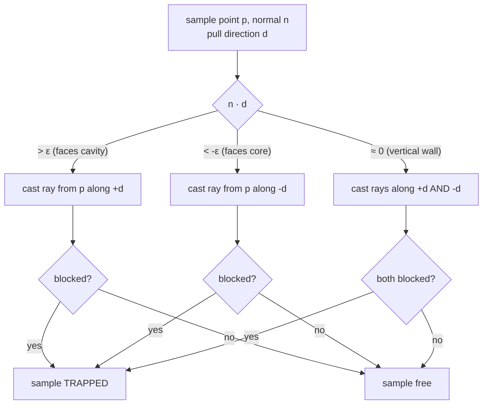
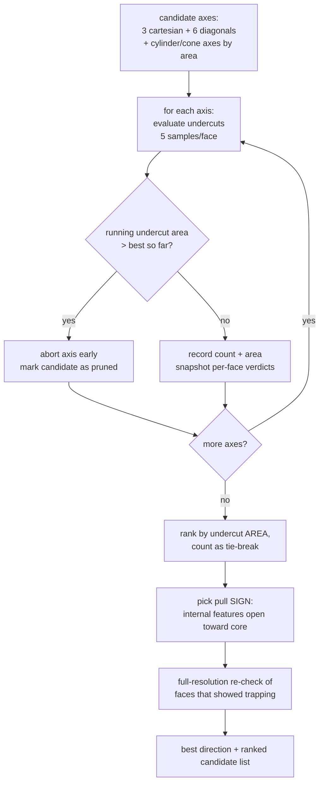
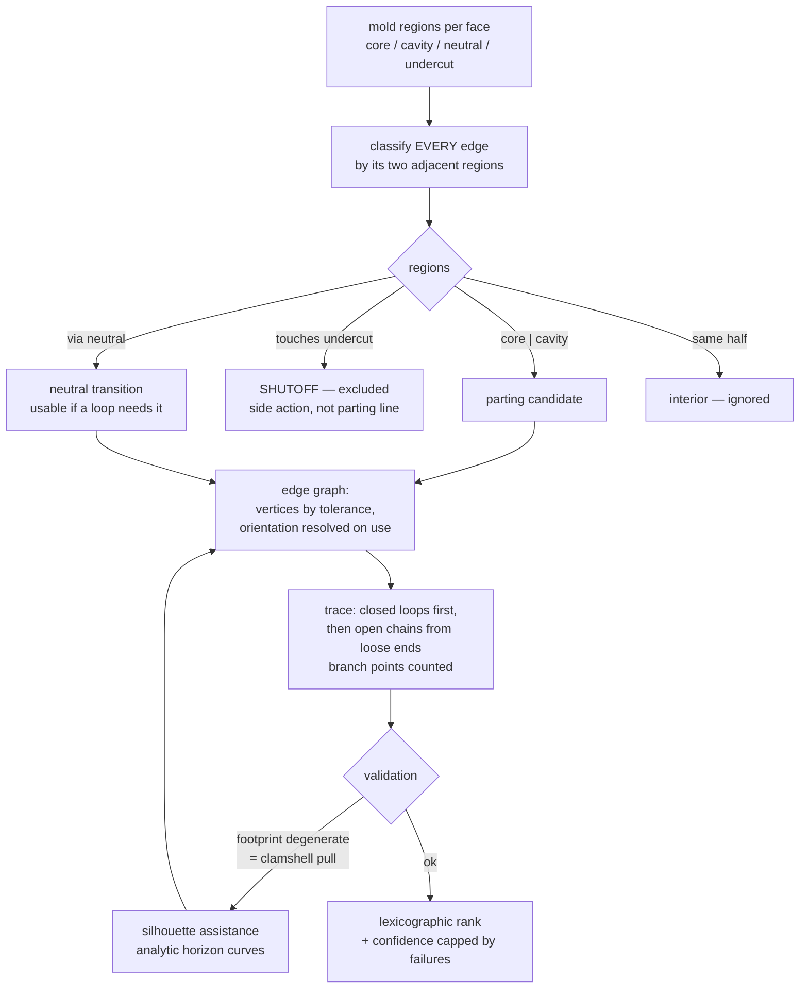

# Technical Document — Methodology Report

DfM Analyzer for Injection Molding — Team Stack.
Covers: system architecture, algorithms (with flowcharts), validation results,
and performance.

**Reflects the v4 engine (17 August 2026).** v4 rebuilt the parting-line
pipeline to be geometry-driven: candidate pull axes from five sources,
four-way ray accessibility, lexicographic direction and loop selection,
region-boundary edge classification, a real edge graph, silhouette assistance
for non-axial pulls, and a validation stage whose confidence is capped by its
failures. Chronology, measurements and the approaches that were tried and
rejected are in `docs/untillnow.md`; the reasoning behind each choice is in
`docs/decision-log.md`.

---

## 1. System Architecture

Client–server, deliberately simple:

- **Backend — Python / FastAPI** (`api.py`): one endpoint `POST /analyze`
  (multipart STEP upload, optional `direction=x,y,z` form field for manual
  override). All geometry runs on OpenCASCADE via the `OCP` bindings
  (`cadquery` for tessellation export).
- **Frontend — React + Vite** (`frontend/`): three.js via
  `@react-three/fiber`. Renders color-coded faces (core / cavity / undercut /
  low-draft warning), the parting line, an exploded core–cavity view, and the
  mold-direction override panel.
- **CLI harness** (`scripts/analyze_cli.py`): headless regression runner used
  to validate every algorithm change against reference parts.

```mermaid
flowchart LR
    A[STEP file] --> B[step_parser\nfaces + surface samples]
    B --> C[pull_direction\ncandidate axes]
    C --> D[accessibility\nray probes, built once per part]
    D --> E[direction_evaluation\nlexicographic selection]
    E --> F[draft_angle\nworst-case per face]
    F --> G[face_classifier\nregions + topology propagation]
    G --> H[undercut_regions\nfeatures + mechanism]
    H --> I[parting/\nboundaries → loops → validation]
    I --> J[JSON response\nmetrics + geometry + validation]
    J --> K[React 3D viewer]
```



Module responsibilities:

| Module | Answers |
| :--- | :--- |
| `core/tolerances.py` | every numerical tolerance, and `AnalysisConfig` |
| `core/pull_direction.py` | which axes are worth trying |
| `core/accessibility.py` | what each mold half can reach and release |
| `core/direction_evaluation.py` | which axis wins, and why |
| `core/face_classifier.py` | which half forms each face |
| `core/undercut_regions.py` | what tooling the trapped features need |
| `core/parting/` | where the two halves meet, and whether that is valid |

---

## 2. STEP Parsing & Surface Sampling (`core/step_parser.py`)

Every face gets a **grid of surface samples**, not just its UV midpoint:

1. Explore all `TopAbs_FACE` entities; compute area, centroid, surface type.
2. Sample a UV grid (3×3 for planes, 5×5 for curved surfaces, capped at 15
   points). Each UV point is kept only if it classifies `TopAbs_IN` (actually
   on the trimmed face, not in a hole).
3. Store the exact surface normal at every sample
   (`GeomLProp_SLProps`, flipped for reversed faces).
4. For cylinders/cones, store the rotational axis — these become
   geometry-driven mold-direction candidates.

**Why**: a cylinder's midpoint normal misrepresents the surface (its normals
span up to 360°). Phase 1's single-normal approach was the root cause of the
undercut false positives. Multi-sampling makes every downstream verdict an
area-weighted vote over the real surface.

---

## 3. Undercut Detection (`core/accessibility.py`, `core/undercut_detector.py`)

**Definition used (from Bosch):** *an undercut is any feature that cannot be
released from the mold* for the chosen opening direction.

The ray physics live in `core/undercut_detector.UndercutRaycaster` and are
unchanged since v2. `core/accessibility.py` is what calls them, keeps the
answers in a structured per-direction result rather than mutating `FaceData`,
and memoises each (sample, direction) probe so the classifier and the
undercut-region grouper reuse the sweep's rays instead of recasting them.

A face is trapped when the half that **forms** it cannot pull away from it:



- Rays via `IntCurvesFace_ShapeIntersector` over a compound of all faces,
  built **once** per part and reused for every direction tested.
- Ray origin offset 0.01 mm along the surface normal; hits closer than
  0.1 mm ignored (self-intersection noise); ray length = 1.5× the part's
  bounding-box diagonal.
- **Transition filter**: only hits where the ray *enters* material
  (`IntCurveSurface_In`) count as blockers. Tangential grazes along adjacent
  walls/fillets (`Out`/`Tangent`) are not physical obstructions — this
  filter is what brings Part 1 to the judges' reference answer of **zero
  undercuts**.
- **Face verdict**: a face is an undercut when ≥ 50 % of its samples are
  trapped (`trapped_fraction`), with per-face early exit once the majority
  is decided either way.
- The trapped test is symmetric in ±d — undercuts depend on the mold *axis*,
  which halves the direction search.
- **The verdict does not depend on where the parting line goes.** It is a ray
  test on the pull axis and the geometry alone. Verified on Part 3: six
  different forced parting-line placements, from ø36 at z=4 to ø12 at z=39,
  return a byte-identical set of 88 trapped faces. Moving a parting line can
  never release an undercut, which is why §7's validation reports them
  separately instead of absorbing them into a score.

**Known limit of the graze filter.** Discarding hits closer than 0.1 mm also
discards a *genuine* obstruction that close. Probing Part 3's bore under a
lateral pull, the ray re-enters solid material at 0.0305 mm and reads as free.
It does not affect any reported result — the rule above tests the direction the
forming half actually travels, which is correctly blocked at 3.93 mm — but a
part with sub-0.1 mm clearances would need this tolerance revisited.

---

## 4. Optimal Mold Direction (`core/pull_direction.py`, `core/direction_evaluation.py`, `core/mold_direction.py`)

**Candidates** come from five sources, deduplicated onto unique axes: the 3
cartesian axes, the 6 quadrant diagonals, rotational feature axes (cylinders
and cones, clustered by area), dominant planar normals, and well-separated
principal axes of the surface point cloud. Bosch's guidance was that ±X/Y/Z
covers "90% of cases" with diagonals for rare edge cases, and that a 5° sweep
is explicitly *not* required.

Principal axes are deduplicated at **10°** rather than the 2.6° used for exact
axes, because they are a statistical estimate: UV sampling is not
area-uniform, so a perfectly axisymmetric part yields a slightly
non-axisymmetric covariance. On `flanged_boss` that produced a "principal
axis" 3.9° off Z which, unfiltered, beat Z itself.

**Selection is lexicographic**, not a weighted sum:

```text
1. any undercuts at all?      ← nothing with undercuts beats something without
2. undercut AREA              ← Bosch: "area will be better to evaluate"
3. undercut count
4. parting complexity         ← connected same-half region count
5. dominant geometric axis
6. core/cavity balance
7. canonical vector           ← deterministic on every run and machine
```

This makes "a shorter parting line beats fewer undercuts" impossible by
construction rather than by hoping the weights are large enough.

The specification's Priority 3, "maximize accessibility", is deliberately
**not** a separate criterion: accessibility is released area over total area,
and total area is a property of the part, identical for every candidate. It is
therefore a strictly decreasing function of undercut area, and criterion 2
already orders by it. It is still reported, because it is meaningful to show.




Key decisions:
- **Ranking metric — area first** (per Bosch guidance): a face split into
  several patches must not outrank one large trapped face.
- **Branch-and-bound pruning**: faces are evaluated biggest-first; an axis is
  abandoned the moment its accumulated undercut area exceeds the incumbent
  best. Losing axes cost ~0 s. Pruned candidates are reported as lower
  bounds (`≥ N` in the UI, `undercuts>N` in the CLI) — never as exact values.
- **Sign selection**: undercut counts are sign-symmetric, but which half is
  *core* vs *cavity* is not. Convention (validated on the judges' cap
  example): **the core forms the internal surfaces**, entering from the side
  the part's internal features open toward; the pull direction (toward the
  cavity) is the opposite. Internal features are detected by ray probes: a
  sample whose own normal points at more part material across a void belongs
  to an internal feature, and the axis direction it escapes toward marks the
  core side. Faces covering 90 % of the surface area vote (area-weighted).
- **Winner refinement, two-tier**: the sweep measures only the *release*
  verdict (`four_way=False`) at reduced sample density, which is all ranking
  needs. The winning axis is then re-measured four-way at sweep density to give
  every face a mold region, and only faces that showed **any** trapping are
  re-measured at full density. Measuring every face four-way at full density
  instead costs 15.4 s of Part 3's 27 s — more than the entire nine-axis sweep,
  which is 3.4 s — to refine numbers already zero for most faces.

## 5. Manual Override

`POST /analyze` with `direction=x,y,z` skips the search and evaluates exactly
that vector: undercuts, classification, parting line, and score are recomputed
so the user immediately sees the consequence of their choice (e.g. previously
free faces flagged as undercuts). The UI exposes ranked candidate buttons, a
custom vector input, and a reset to the auto-detected optimum.

### API response — what v4 added

**Purely additive. Every pre-v4 key keeps its name, type and meaning**
(specification §20: no unmigrated contract breaks).

| Path | New in v4 |
|---|---|
| `geometry.parting_lines[]` | now carries **every closed loop**, not just the primary. Was primary-only unless `?debug=true` |
| `geometry.parting_lines[].polyline` | the loop's points **in traversal order** — what a viewer should draw. `segments` (per-edge) stays for compatibility |
| `geometry.parting_lines[].{length, projected_area, branch_points, is_planar, source, shutoff_length}` | loop diagnostics; `source` is `topology` or `silhouette`; `shutoff_length` is the stretch formed by a side action rather than the two main halves |
| `geometry.parting_line_confidence`, `geometry.parting_line_is_valid` | validation summary |
| `parting_line` | full validation report: named checks with pass/fail and reason, quality metrics, capped confidence |
| `direction_candidates[].{source, undercut_severity, accessibility, complexity, region_count, score}` | why one direction beat another, so the ranking is explainable rather than a bare ordering |

The viewer draws each loop as one continuous `<Line>` from `polyline`
(primary `#3B82F6` at width 4, others `#7C3AED` at width 2), plus a
pull-direction arrow. Previously it rendered each CAD edge as its own line —
a disconnected collection of edges presented as a parting line, which is
exactly what §13 forbids.

---

## 5b. Accessibility (`core/accessibility.py`)

Specification §4 asks for a geometry/visibility method rather than a
`dot(face_normal, D)` test. For every surface sample this module casts a ray
along **+D and −D** and keeps both answers, so downstream stages can ask the
four-way question: reachable from +D only, −D only, both, or neither.

Two distinct questions are measured, and conflating them is a real source of
wrong answers:

- **Reachability** — can a tool arriving from the +D side touch this point at
  all? Decides *which half forms* the surface.
- **Release** — can the half that actually forms this surface pull away from
  it? Decides whether it is an **undercut**.

Release is stricter, and it is the one that defines an undercut. A face tucked
under an overhang, normal pointing toward the cavity but roofed by material
above, is reachable from −D yet cannot be released by the half that forms it.
The specification's four-way table alone would call that "−D only → opposite
mold half" and miss it. The release rule is unchanged from v2, where it is
validated against Bosch's stated answer for Part 1 (zero undercuts) and
against a built mould's slide core for the reference bush.

The direction **sweep** measures release only (`four_way=False`); the winning
axis is then re-measured with the full four-way. Measuring reachability for
every candidate doubled the sweep's ray count to produce numbers only the
winner uses.

## 6. Face Classification (`core/face_classifier.py`)

Every face gets `mold_half` (which half **forms** it) and `classification`
(render label: core / cavity / undercut):

1. **Normal voting**: area-weighted vote over surface samples —
   `n·d > 0` → cavity, `n·d < 0` → core.
2. **Vertical walls** (all samples perpendicular): assigned by
   **reachability** — rays from the wall toward each half; if the path
   toward the cavity is blocked (e.g. a bore under a closed top), only the
   core can form it, and vice versa.
3. **Through-holes / internal channels** (reachable from both halves but
   facing part material across a void): assigned to the **core** (core-pin
   convention, matching the judges' cap example).
4. External walls reachable from both halves default to the **cavity** (the
   cavity wraps the cosmetic exterior; the parting line sits at the rim).

Draft (`core/draft_angle.py`) is orthogonal: worst-case draft angle per face
= min over samples of `asin(|n·d|)`; faces under 1° are flagged as warnings
(not undercuts — Bosch parts intentionally carry no design draft).

**Two further stages** run on top of the four above (`classify_mold_regions`):

5. **Accessibility reconciliation.** Specification §7 requires the final
   classification to be consistent with accessibility. Where the four-way
   probe is *decisive* — one side reaches the face, the other essentially
   cannot — and disagrees with the stages above, accessibility wins: steel
   that cannot touch a surface cannot form it. Where the probe is not
   decisive, the stages above stand, because a normal vote carries real
   information reachability alone does not.
6. **Topology propagation.** Sliver faces (below `SLIVER_FACE_AREA`) take the
   half their non-sliver neighbours agree on, weighted by shared edge length,
   iterated to a fixed point. A 0.2 mm fillet has no reliable normal and no
   meaningful reachability of its own; letting it disagree with the wall it
   blends into puts a spurious loop of parting line around it.

Each face also carries `mold_region` (`core`/`cavity`/`neutral`/`undercut`/
`ambiguous`) alongside `mold_half`. `mold_half` answers "which steel forms
this face" and is always one of the two halves — a face has to be molded by
something, and the API and viewer are built on that. `mold_region`
additionally records where the answer came from and admits when it is
undecided, which is what the parting boundary needs: a NEUTRAL face borders
both halves without separating them, and an edge against an UNDERCUT face is
a shutoff, not a parting line.

---

## 7. Parting Line (`core/parting/`)

**Definition used (from Bosch):** *the parting curve is where core surfaces
and cavity surfaces meet*, and the main parting line must be **one closed
continuous loop** (a discontinuous loop cannot form a mold face).

The parting line is an **output of mold accessibility and region
classification**, never an edge-selection heuristic. Nothing in this stage
looks for an edge and then justifies the choice: edges become candidates only
because the faces on either side of them belong to opposite mold halves.



**Boundary extraction** (`boundary.py`). An edge bordering an `UNDERCUT`
region is a **shutoff** — the surface where a slider or lifter meets the main
halves — and is excluded from the parting line. This is the single largest
correctness fix in v4: on Part 3, **48 of 51** candidate edges bordered an
undercut face, so 94 % of the candidate set was the outline of two rib
pockets. Halves decide *whether* an edge separates the mold; regions decide
whether it is parting line or shutoff. Both are needed — an ordinary
two-plate part is mostly neutral faces, which have no region of their own but
are still formed by one half.

**Loop tracing** (`loops.py`). A real graph, not connected components. A
component containing a branch point, or two disjoint loops, used to come back
as one open chain. Closed loops are extracted first (seeded from degree-2
vertices so a clean rim is never entered through a junction), then open chains
are traced **from their loose ends** — seeding mid-path splits one gap into
two. At a branch the walk takes the smoothest continuation, which follows a
rim past an incidental spur instead of turning up it.

**Silhouette assistance** (`silhouette.py`, specification §10). When the pull
runs *across* the part, the split is a clamshell plane passing through the
middle of the outer wall, where the B-rep has **no edge at all** — so no
amount of edge selection can produce it. Analytic horizon curves are computed
for cylinders, cones and planes (free-form surfaces are reported as
unsupported rather than approximated). It runs **only when validation rejects
the topological result**, so parts that already work cannot regress.

**Selection** is lexicographic — closed → no branch points → separates both
halves → true silhouette coverage → planar → shorter — never a weighted sum.
The projected footprint is measured against the part's **real** projected
outline (convex hull of its densely tessellated edges), not its bounding box,
which used to cap every circular rim at π/4 = 0.785.

**Validation** (`validation.py`, specification §12) runs topological,
geometric and mold checks, reports the six named quality metrics, and computes
a confidence that is **capped** by whatever failed rather than averaged with
it. A result that is not manufacturable can never come back wearing a high
number.

Ambiguity flag: if the top two loops' outer-boundary ratios are within 5 %,
the result is marked ambiguous and both are exposed to the UI.

---

## 7b. Declared Tooling Plans (`core/delegation.py`)

A two-plate mold forms a part with two halves on one axis. Real molds do more:
a side core forms an internal passage, an insert forms a splined end. Bosch's
walkthrough of the nozzle is exactly this shape
(`docs/bosch-nozzle-review-transcript.md`, 00:42.8): *"It splits the two halves,
and then there will be a side core, which is used to form this, uh, pin
feature."*

A **delegated group** is a set of faces the caller declares some mechanism
other than the two main halves forms. Those faces leave the main halves' books:
they are not undercuts of the pull direction, because the pull was never asked
to release them.

### Why delegation is an input and never a derived result

**Delegation always terminates at zero.** Any undercut set whatsoever reaches
"0 undercuts" if you delegate the faces that constitute it. Measured on Part 3:

- axial Z− traps 1366.8 mm² in two slot regions; delegating those two regions —
  precisely the tooling the engine already recommends — gives **0.0 mm²**;
- the clamshell traps the bore and splines; delegating those gives **0.0 mm²**.

Both reach zero. Zero is therefore not evidence of anything; it is a
restatement of what was delegated. If the engine chose delegations for itself,
every part would report zero undercuts and the undercut analysis would convey
nothing — and Part 1's zero, which is genuine and needs no side actions at all,
would become indistinguishable from Part 3's, which costs two extra actions.
That distinction is the most valuable thing the tool says about a part.

So a plan is **declared** by the caller, per part, in a JSON file beside the
model (`assets/Part3.tooling.json`), and `ToolingPlan.required_actions` travels
with the result to the API and the UI. A zero can never be read without the
price of that zero beside it.

### Selectors

Groups are selected geometrically wherever possible — a `z_min` band survives a
re-export, whereas explicit face ids shift if the model is re-exported and are
best reserved for a handful of named faces. Part 3 uses both: `face_ids` for the
three bore faces, `z_min: 31.0` for the whole splined section.

### Declared pull direction

A plan may also declare `preferred_direction`. The direction search cannot
afford to build a parting line for every candidate — classification alone is
~4 s per direction on a 414-face part — so when several directions tie at zero
undercuts it separates them on cheap proxies, and any of them is defensible. A
designer choosing between them on parting-line quality supplies information the
search did not have.

It is **verified, never trusted**: `analyze_part` measures the declared
direction and accepts it only if it traps no more than the derived winner,
otherwise the derived winner stands and `preferred_direction_note` records the
rejection.

### Part 3's three configurations

| | Pull | Undercuts on main halves | Extra tooling | Main-half surface | Motion axes |
| :--- | :--- | :--- | :--- | :--- | :--- |
| **Primary — clamshell** | (0.819, 0.574, 0), 35° | **0** | bore side core + spline insert, both ±Z | 4706.7 mm² (62%) | 1 |
| **Alternative 1 — axial, as-is** | Z− | 88 faces / 1366.8 mm² | **none** | 6195.3 mm² (82%) | 0 |
| **Alternative 2 — axial + sliders** | Z− | **0** | 2 opposed sliders, 1 lateral axis | 6195.3 mm² (82%) | 1 |
| Other clamshell orientations | PN2 / XY+ / −AX2 | **0** | needs the same bore + spline delegation | ~72.5% | 1 |

Every figure is **measured, not asserted**. Whether a configuration needs the
declared plan is re-measured per direction (`_plan_area_needed_by`): the axial
pull draws the bore and splined end cleanly and so is charged nothing for them,
while every clamshell orientation genuinely cannot form them. Alternative 2 is
produced by the engine, running the same region grouper the primary path uses —
it reports 2 regions, `side-action slider` ×2, on axis (0.643, −0.766, 0).

**Read the whole row.** Both zeros are reached by *delegating*, and delegation
always terminates at zero — any undercut set vanishes if its faces are handed
to other tooling. What separates the configurations is the last two columns.

One asymmetry to keep in view: the primary is charged its **declared** groups
in full (2855.4 mm² — an insert forms the whole splined end, not only the
trapped subset), whereas alternatives are charged the **minimum** their
geometry forces. That is why neighbouring clamshell orientations show ~72.5%
against the primary's 62%. Both are honest; they answer different questions.

Alternative 1 is the only configuration needing no side actions, which is why
`_alternatives` always keeps an axial option in the list even when it ranks
worst on trapped area: a truncated list would present the clamshell as though
it had no competition.

The clamshell orientation is a **plateau, not a point** — measured zero across
30°–50°, plus 130°. 35° is declared because its parting line is markedly
cleaner (18 edges, outer-boundary ratio 0.451, confidence 0.490) than 130°
(94 edges, 0.090, 0.342).

### What validation reports

`no_undercuts_remaining` counts only non-delegated faces. A second check,
`side_actions_required`, is informational — it does not fail — and its detail
is what stops a zero being read as "no tooling needed":

> the two main halves are clean ONLY because 2 feature group(s) totalling
> 2855.4 mm² are formed by separate tooling on 1 additional axis/axes:
> through-bore → axial side core along (0.00,0.00,1.00) [3 faces, 1548.1 mm²];
> splined end → axial insert / lifter along (0.00,0.00,1.00) [280 faces, 1365.1 mm²]

Metrics gain `delegated_area`, `delegated_group_count`, `required_action_axes`,
`main_half_area` and `main_half_area_fraction`.

`delegated_area` counts each face **once**. Groups may overlap — Part 3's bore
chamfer at z=39.5 is in the bore group by face id and in the splined section by
z band — so summing the per-group areas double-counts the intersection and
reports 2913.2 mm² where the true figure is 2855.4.

### How it surfaces in the UI

Three places, so a delegated zero cannot be read as a geometric one:

1. **Undercuts card** — relabels to "Undercuts (main halves)", adds an amber
   `+N side actions` badge next to the count, and replaces the caption with
   "Two main halves only — N mm² is formed by separate tooling". Part 1, which
   needs no side actions, shows the plain card unchanged.
2. **Required Tooling panel** — appears only when a plan delegates something.
   Lists each group with its mechanism, travel axis, face count, area and the
   rationale from the plan, plus the outcome of verifying the declared pull
   direction. Headed by the total and the axis count.
3. **Alternative Configurations panel** — the selected configuration plus the
   runners-up, each with undercut count *and* main-half coverage, so the
   comparison is the whole row. Axial rows carry a `NO SIDE CORE` marker; rows
   with a non-zero count are footnoted as needing further actions of their own.

---

## 8. Manufacturability Score (`core/models.py`)

`100 − area-weighted undercut penalty − count penalty − low-draft penalties`,
clamped to [0, 100]. Both area and count matter: one large undercut is
usually easier to fix than twenty scattered ones.

---

## 9. Validation & Performance

Reference results (WSL2, single core, includes STEP parse):

<<<<<<< Updated upstream
| Part | Faces | Best pull | Undercuts | Core/Cavity | Primary PL | Time |
|---|---|---|---|---|---|---|
| Part 1 (Phase 1 cap) | 311 | Z+ | **0** (= judges' answer) | 261 / 50 | closed rim, 32 edges | ~2 s |
| Part 2 / Part3.stp (Phase 2) | 414 | Z− | 88 (genuine side-action clips) | 322 / 4 | closed outer rim 36×36 @ z=1 | ~14 s |
| GrabCAD cup holder | 56 | Z− | 8 (snap-clip clusters) | 42 / 6 | closed rim 101×100 | ~1 s |
| Synthetic cup (ø60×80, 3 mm wall) | 5 | Z− | 0 | inner=core, outer=cavity | rim, area err 0.16 % | <0.1 s |
| Synthetic cap + lateral hole | 7 | Z− | exactly the 2 hole walls | correct | closed rim | <0.1 s |
=======
| Part | Faces | Best pull | Undercuts | Primary parting line | Valid | Conf. | Time |
|---|---|---|---|---|---|---|---|
| Part 1 (Phase 1 cap) | 311 | Z+ | **0** (= judges' answer) | planar closed rim, 8 edges @ z=15 | ✓ | 0.898 | 1.5 s |
| Part 3 (Phase 2) | 414 | Z− | 88 faces = **2 regions** | planar closed circle ø36 @ z=4 | ✗ | 0.745 | 17.1 s |
| `flanged_boss` | 5 | Z− | 0 | closed loop on the flange OD | ✓ | 0.894 | <0.1 s |
| `stepped_cylinder` | 5 | Z+ | 0 | closed rim at the max silhouette | ✓ | 0.846 | <0.1 s |
| `open_cup` / `capped_cup` | 5 | Z∓ | 0 | planar rim; bore=core, shell=cavity | ✓ | 0.888 | <0.1 s |
| `solid_box` / `solid_cube` | 6 | Z+ | 0 | rectangular outline | ✓ | 0.82–0.83 | <0.1 s |
| `grooved_cylinder` | 7 | **Y−** | 0 | **clamshell**, 12 edges, plane through the axis | ✓ | 0.798 | <0.1 s |
| `oring_nozzle` | 8 | **Y+** | 1 (the bore) | **2 clamshell loops**, 40 mm of shutoff | ✗ | 0.394 | <0.1 s |
| `cylinder_blind_pocket` | — | **X−** | 0 (pull releases the pocket) | clamshell loop | ✓ | 0.801 | <0.1 s |

Times are the `/analyze` fast path (branch-and-bound pruning). The exact
ranking pass, which `POST /analyze/directions` serves separately, is 5.6 s for
Part 1 and 33.5 s for Part 3.

The two rows marked invalid are the point of the validation stage. Part 3's
parting line is correct and its remaining 18.1 % of trapped area is real — two
rib pockets that need side action, which no parting line can solve. The
nozzle's loop only *closes* because a side core forms its bore, and 40 mm of
its length is reported as shutoff rather than counted as parting line. Neither
is reported as solved, and both confidences are capped by the failure.
>>>>>>> Stashed changes

Synthetic parts are generated with known ground truth (cadquery) and asserted
<<<<<<< Updated upstream
in a 9-point regression suite that gates every algorithm change.
=======
in an **86-test** suite that gates every algorithm change:

| File | Tests | What it pins down |
|---|---|---|
| `tests/test_synthetic.py` | 24 | construction-known answers — a cup's bore is core, a radial hole is the only undercut under an axial pull |
| `tests/test_parting_line_topology.py` | 11 | the primary loop is a single closed **planar** loop; clamshell loops lie in a plane containing the part axis |
| `tests/test_pull_direction.py` | 30 | candidate generation, normalisation, dedup, and the lexicographic ordering — including that a shorter parting line can never buy off undercuts |
| `tests/test_parting_pipeline.py` | 21 | boundary classification, edge graph, edge orientation, closed-loop vs open-chain, and the section-18 acceptance cases |

The planarity assertion exists because its absence let Part 1's parting line
regress from a flat rim to a meandering loop across three commits without any
test failing. `test_no_parting_candidate_touches_an_undercut_face` exists
because 48 of Part 3's 51 candidate edges used to be undercut-pocket outlines.

### Part 3's undercuts, independently verified

The 88 trapped faces were checked against four independent lines of evidence
rather than taken from the classifier (full workings in `docs/untillnow.md`):

1. **Silhouette profile** — global max radius is 18.000 and the only valid
   straight-pull split band is z ∈ [1.00, 4.50]. The reported loop is at
   z = 4.00, inside it. (The 19.49 in the bounding box is an OCC control-polygon
   overestimate, not geometry.)
2. **Ray probe** — faces 21 (z=15.5) and 23 (z=18.5) are blocked in **both**
   ±Z, at 6.01 mm and 2.99 mm. No mold half on any parting surface, planar or
   stepped, can form them.
3. **Forced-split invariance** — six parting-line placements spanning
   r=18/z=4 to r=6/z=39 give a **byte-identical** undercut set.
4. **Suppression** — filling the two pockets drops undercut area from
   1366.8 mm² to 5.2 mm² while the parting line does not move.

A clamshell (plane through the part axis) was swept at 5° over 36 orientations.
It releases **all 88** — the two undercut sets are entirely disjoint — but
traps the through-bore (face 35, 1432.6 mm², more than the entire axial set)
and the splines (589.7 mm²) instead, for **2080.0 mm² against 1366.8 mm²**.
Axial Z− with two opposed sliders is the correct answer.
>>>>>>> Stashed changes
